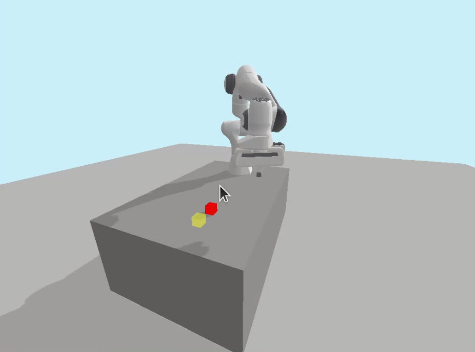
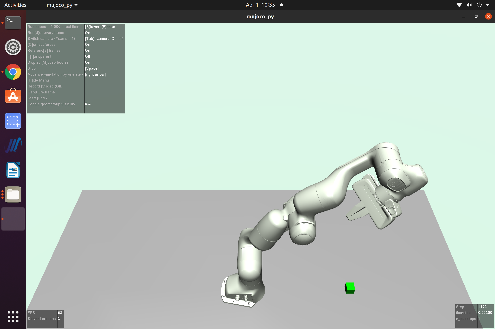

# push_panda 🦾

newpanda is an adaptation of pandagym to
 control the robotic arm franka panda for a push simulation 
 and extract time and end-effector position data 
 from it. Contrary to pandagym, it doens't use OpenAI/gym 
 robotic environments but only rely on PyBullet physics engine.
 
 A Mujoco push simulation has also been establish by adapting Saif Sidhik and 
Baris Yazici works (https://github.com/justagist/mujoco_panda) in order to realise a push simulation from pre-existing commands stored in a text file in the datafile folder.
 
 The goal is to test the performances of Pybullet 
 and MuJoCo as a physics engine for reinforcement learning 
 applications in robotics.
 
 

## Features

In order to run this project, multiple prerequisites are needed:
- mujoco-py package from MuJoCo
- python3
- ROS Noetic

Specific at Mujoco simulation:
- pip install numpy-quaternion


## Deployment

To deploy a simulation of the panda robotic arm multiple files
can be run in a terminal.

To start a demonstration of the simulation with Pybullet, run:
```bash
  python3 main.py "basic"
```

To start the throw simulation with Pybullet, run:
```bash
  python3 main.py "throw"
```

To start the push simulation with Pybullet, run:
```bash
  python3 main.py "push_online"
```
To start the push simulation with Pybullet at fixed speed, run:
```bash
  python3 main.py "push_constant_speed"
```

To start the push simulation with Pybullet and record the joint angles on a text file "text_file_name.txt", run:
```bash
  python3 main.py "push_online" "text_file_name.txt"
```

To redo the push simulation with Pybullet based on saved results on the text file "text_file_name.txt" with a period of p seconds, run:
```bash
  python3 main.py "push_offline" "text_file_name.txt" p
```

To redo the push simulation with MuJoCo based on saved results on the text file "text_file_name.txt" with a period of p seconds, run:
```bash
  python3 mujoco_demo.py "text_file_name.txt" p
```

## Screenshots





## Author

- [@LouiseMassager](https://github.com/LouiseMassager)


## Acknowledgements

 - [panda gym](https://github.com/qgallouedec/panda-gym)
 - [franka panda](https://github.com/vikashplus/franka_sim)
 - [mujoco panda](https://github.com/justagist/mujoco_panda)

