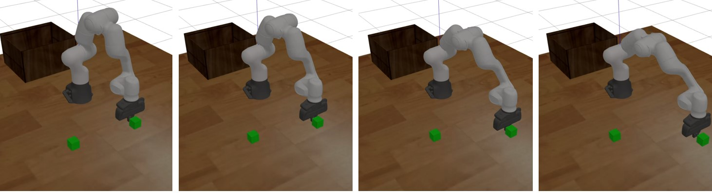

# MoveRL
# :panda_face:

This file has been adapted from Gaoyan Liu works (https://github.com/Gaoyuan-Liu/MoveRL) in order to realise a push simulation from pre-existing command stored in a text file. The additional work realised is in the ma1_project folder(https://github.com/LouiseMassager/MA1project/tree/main/MoveRL/src/ma1_project).


## Screenshots
- Gazebo simulation:


## Deployement
To deploy a simulation of the panda robotic arm multiple files
can be run in a terminal. First ros must be deployed in a terminal:
```bash
 roscore
```

Then open a second terminal.
To start the push simulation with Gazebo, run:
```bash
  cd MoveRL
  catkin_make
  source devel/setup.base
  roslaunch rl_interface main.launch
```
Open a third terminal in order to command the robot in the Gazebo window.
To start the push simulation with the text file named datafile (str) at a period (float) p:
```bash
  cd MoveRL
  roslaunch ma1_project pushpanda.launch datafile p
```
datafile must be the name of the file in the datafiles folder (eg. "jointsangles.txt") while p must be a period high enough for your computer performances (eg. 0.01).
 

## Features

In order to run this project, multiple prerequisites are needed:
- python3
- ROS Noetic
- sudo apt-get install ros-noetic-ros-control ros-noetic-ros-controllers

## Author

- [@LouiseMassager](https://github.com/LouiseMassager)


## Acknowledgements

 - [MoveRL](https://github.com/Gaoyuan-Liu/MoveRL)
