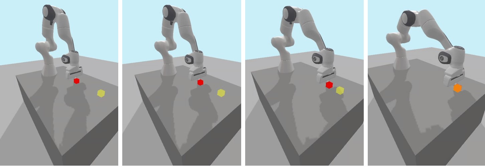
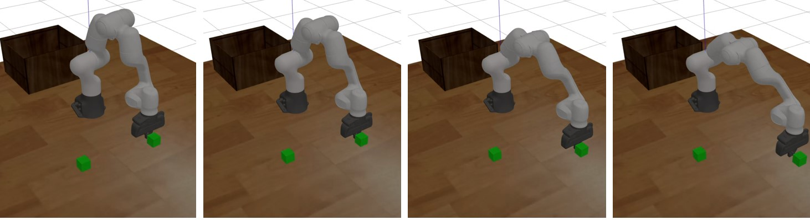
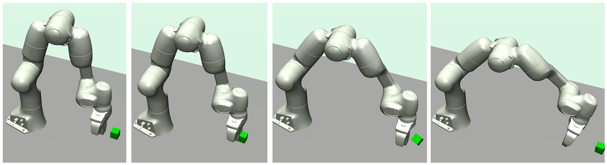

# MA1_project :mechanical_arm: :robot:

This project regroup the control of the robotic arm franka panda for a push simulation with 3 different physics engine: Pybullet, Gazebo and Mujoco.
All files are launched with ROS and Python3 is the main programming language for the code.

The Pybullet simulation must first be ran to compute the command for the simulation in Gazebo and MuJoCo (by storing the joints commands in the data file).

An important part of the code comes from other works:
- Pybullet simulation is based on pandagym (https://github.com/qgallouedec/panda-gym)
- Gazebo simulation is based on Gaoyuan Liu works (https://github.com/Gaoyuan-Liu/MoveRL))
- MuJoco simulation is based on Saif Sidhik and Baris Yazici works (https://github.com/justagist/mujoco_panda)

 The goal is to test the performances of Pybullet 
 and MuJoCo as a physics engine for reinforcement learning 
 applications in robotics.
 
 
## Screenshots
- PyBullet simulation:

- Gazebo simulation:

- MuJoCo simulation:



## Features

In order to run this project, multiple prerequisites are needed:
- mujoco-py package from MuJoCo
- python3
- ROS Noetic

Specific at Mujoco simulation:
- pip install numpy-quaternion

Specific at Gazebo simulation:
- sudo apt-get install ros-noetic-ros-control ros-noetic-ros-controllers


## Deployment

To deploy a simulation of the panda robotic arm multiple files
can be run in a terminal. First ros must be deployed in a terminal:
```bash
 roscore
```

Then open a second terminal.
- To start the push simulation with Pybullet without ROS, run:
```bash
  cd MA1project_ws
  cd MA1project_ws/src/ma1_project/push_panda
  python3 main.py "push_offline" "jointsangles_s0.01.txt" 0.01
```
There are multiple possibilities for *args. To see the possibilities put anything instead (eg. python3 main.py 'help').

- To start publishing the joints angles from the datafile data at period p on the topic 'chatter' ROS, run:
```bash
  cd MA1project_ws
  catkin_make
  source devel/setup.bash
  roslaunch ma1_project main.py datafile:=data period:=p
```
data must be the name of the file in the datafiles folder (eg. "jointsangles.txt") while p must be a period high enough for your computer performances (eg. "0.01").

- To start the push simulation with MuJoCo with the text file named datafile (str) at a period (float) p, run:
```bash
  cd MA1project_ws/src/ma1_project/push_panda
  python3 mujoco_demo datafile datafile period
```
datafile must be the name of the file in the datafiles folder (eg. "jointsangles.txt") while p must be a period high enough for your computer performances (eg. 0.01).

- To start the push simulation with Gazebo, run:
```bash
  cd MoveRL
  catkin_make
  source devel/setup.base
  roslaunch rl_interface main.launch
```
Open a third terminal in order to command the robot in the Gazebo window.
To start the push simulation with the text file named data (str) at a period (float) p:
```bash
  cd MoveRL
  roslaunch ma1_project pushpanda.launch datafile:=data period:=p
```
datafile must be the name of the file in the datafiles folder (eg. "jointsangles.txt") while p must be a period high enough for your computer performances (eg. "0.01").

## Author

- [@LouiseMassager](https://github.com/LouiseMassager)


## Acknowledgements

 - [panda gym](https://github.com/qgallouedec/panda-gym)
 - [franka panda](https://github.com/vikashplus/franka_sim)
 - [mujoco panda](https://github.com/justagist/mujoco_panda)
 - [MoveRL](https://github.com/Gaoyuan-Liu/MoveRL)
